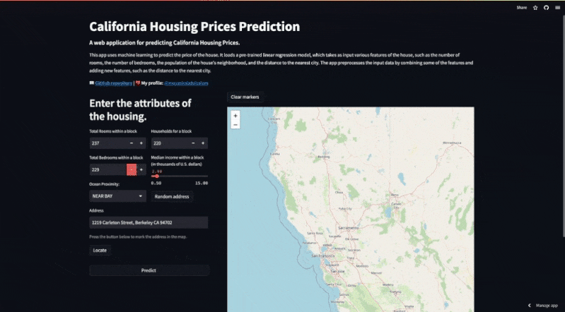

<h1>HouseForcast</h1>

<h2>About Project</h2>

In this project, we will use linear regression techniques with Python's scikit-learn library to predict housing prices in California. The objective is to understand which characteristics of a residential property (such as number of bedrooms, location, local income, etc.) influence its market value.

The dataset used was taken from Kaggle and refers to the 1990 census. We will use data cleaning and pre-processing techniques so that it is ready for analysis.

Next, we will use linear regression to model the relationship between the home's characteristics and its market price. To evaluate the quality of the model, we will use metrics such as R² and RMSE.

Finally, a web application was created, using Streamlit, in which it is possible to predict the value of a property according to data provided by the user. We will analyze the results and understand the project's business vision, which can be useful to help real estate professionals, investors and even people who are looking for a house to buy.
<strong><a href="https://houseforcast.streamlit.app">HouseForcast App</a></strong>

<h2>Description of Data</h2>

The dataset has the following variables:

<ul>
<li>longitude: longitude of a given set of houses</li>
<li>latitude: latitude of a given set of houses.</li>
<li>housing_median_age: median age of houses in a block.</li>
<li>total_rooms: total number of rooms in a block of houses.</li>
<li>total_bedrooms: total number of bedrooms in a block.</li>
<li>population: population of the locality in a block.</li>
<li>households: total number of families, groups of people residing in a household unit, per block.</li>
<li>median_income: median income in a block.</li>
<li>ocean_proximity: Proximity to the ocean (less than an hour to reach the ocean; land; near the ocean;
near a bay; on an island).</li>
</ul>
<h2>Overview of Methodology</h2>
<ol>
<li>Import the data and libraries</li>
<li>Understand data and its types</li>
<li>Exploratory Analysis</li>
<li>Feature Engineering</li>
<li>Modeling</li>
<li>Deployment</li>
</l>